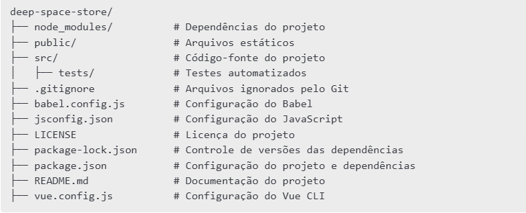

# 💳 Deep Space Store - Página de Pagamento
## Sobre o Projeto

O Deep Space Store é uma loja online fictícia, e este repositório contém a implementação da sua página de pagamento. O usuário pode visualizar uma oferta de um produto e preencher seus dados para efetuar o pagamento.

## Tecnologias Utilizadas

- [V@vue/cli 5.0.8](https://cli.vuejs.org/)
- [node v20.16.0](https://nodejs.org/pt)
- [vue router](https://router.vuejs.org/)
- [vuex](https://vuex.vuejs.org/)
- [vuetify](https://vuetifyjs.com/en/)
- [vue i18n](https://vue-i18n.intlify.dev/)
- [Axios mock adapter](https://www.npmjs.com/package/axios-mock-adapter)

## Estrutura do Projeto




## Como Executar o Projeto
Certifique-se de ter o Node.js instalado em sua máquina.

## Instalação

```
git clone https://github.com/seu-usuario/deep-space-store.git
cd deep-space-store
npm install
```

## Executando o Projeto

Para rodar a aplicação em ambiente de desenvolvimento:

```
npm run serve
```

Para gerar a versão de produção:

```
npm run build
```
Para rodar a análise de código estático (lint):

```
npm run lint
```

Para rodar os testes automatizados:

```
npm run test
```